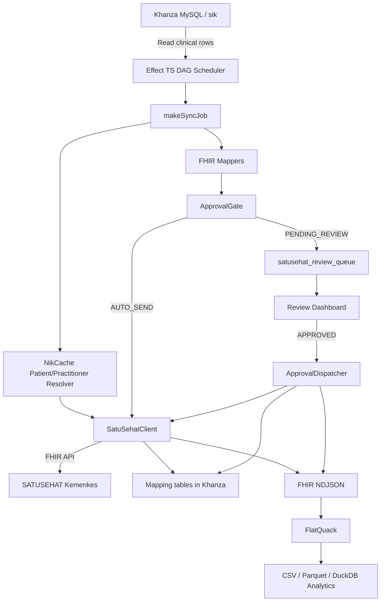

# ATR-007: Aplikasi Satelit `khanza-satusehat-sync` untuk Modernisasi Integrasi SATUSEHAT

## Status
**Accepted / Implemented** (Aplikasi satelit pertama untuk modernisasi Khanza legacy)

## Konteks & Latar Belakang (Context)
Khanza adalah aplikasi legacy yang masih menjadi *system of record* operasional rumah sakit. Karena sudah dipakai luas dan menyentuh proses klinis harian, strategi modernisasi yang paling aman bukan *big-bang rewrite*, melainkan membangun aplikasi satelit di sekitar Khanza.

`khanza-satusehat-sync` adalah aplikasi satelit pertama yang sudah dibangun untuk memodernisasi area integrasi SATUSEHAT. Aplikasi ini mengambil data dari database Khanza, melakukan transformasi ke payload FHIR R4, mengirim ke API SATUSEHAT, menyediakan *human-in-the-loop approval* untuk data sensitif, dan menyiapkan data analitik lokal melalui NDJSON + FlatQuack/DuckDB.

Masalah yang diselesaikan:
1. **Compliance risk:** pengiriman data EMR ke SATUSEHAT wajib dijaga konsisten agar persentase kepatuhan faskes tidak turun.
2. **Legacy coupling:** logic pengiriman SatuSehat lama melekat ke aplikasi/daemon Java, sulit dipantau, sulit di-*deploy* headless, dan sulit diuji secara modular.
3. **Blocking I/O:** lookup NIK pasien/dokter dan request HTTP eksternal dapat memperlambat flow sinkron jika dilakukan langsung dari aplikasi legacy.
4. **Revenue assurance:** beberapa resource klinis berhubungan dengan tindakan, resep, lab, radiologi, dan potensi klaim. Tidak semua data harus langsung terkirim tanpa review.
5. **Operational analytics:** laporan analitik berat tidak boleh membebani database operasional Khanza.

## Keputusan Arsitektural (Decision)
Kita menerima `khanza-satusehat-sync` sebagai aplikasi satelit resmi untuk domain SATUSEHAT, dengan prinsip:

1. Khanza tetap menjadi *source of truth* transaksi klinis dan administratif.
2. `khanza-satusehat-sync` menjadi *integration engine* eksternal yang membaca database Khanza secara periodik.
3. Mapping FHIR, OAuth SATUSEHAT, scheduling, approval gate, NDJSON export, dan analytics pipeline dipindahkan ke service satelit.
4. Service berjalan headless menggunakan **Bun + TypeScript + Effect TS**.
5. Deployment dilakukan sebagai service/container lokal intranet rumah sakit.

## Ruang Lingkup Implementasi

### 1. Runtime dan Dependency Injection
Entrypoint service berada di:

```text
khanza-satusehat-sync/src/index.ts
```

Service menggunakan Effect Layer untuk merangkai:
- `AppConfigLive`
- `DatabaseLive`
- `SatuSehatClientLive`
- `NikCacheLive`
- `ApprovalGateLive`
- `NdjsonWriterLive`
- `FlatQuackRunnerLive`
- scheduler/orchestrator

Keputusan ini membuat dependency lebih eksplisit dibanding pola legacy yang tersebar di banyak class GUI atau singleton global.

### 2. Scheduler DAG SATUSEHAT
Orchestrator berada di:

```text
khanza-satusehat-sync/src/scheduler/Orchestrator.ts
```

Stage utama:
1. `EpisodeOfCare`
2. `Encounter`
3. Resource klinis dan ServiceRequest secara paralel
4. `Specimen`
5. `Observation`
6. `DiagnosticReport`
7. FlatQuack analytics export

Keputusan ini menjaga dependency FHIR yang berurutan, misalnya `Encounter` harus ada sebelum banyak resource klinis lain direferensikan.

### 3. Generic Sync Runner
Runner utama berada di:

```text
khanza-satusehat-sync/src/jobs/_runner.ts
```

`makeSyncJob()` menjadi abstraksi utama untuk:
- Query data Khanza.
- Filter row pending.
- Resolve patient/practitioner SATUSEHAT ID.
- Build FHIR payload.
- Route ke approval gate.
- Send ke SATUSEHAT.
- Simpan mapping balik ke tabel Khanza.
- Append payload sukses ke NDJSON.

Graphify mengonfirmasi `makeSyncJob()` sebagai salah satu *god nodes*, sehingga semua peningkatan reliability lintas resource sebaiknya ditempatkan di runner ini.

### 4. SATUSEHAT Client dan NIK Cache
Client berada di:

```text
khanza-satusehat-sync/src/services/SatuSehatClient.ts
khanza-satusehat-sync/src/services/NikCache.ts
```

Keputusan:
- OAuth2 SATUSEHAT dipusatkan di satu client.
- Request FHIR dibuat melalui interface `post`, `put`, dan `get`.
- Lookup NIK pasien/dokter diberi cache in-memory dengan TTL.

Graphify mengonfirmasi `NikCache` sebagai node penghubung paling penting lintas banyak job. Artinya `NikCache` adalah titik leverage utama untuk performa dan reliabilitas.

### 5. Approval Gate dan Revenue Assurance
Approval flow berada di:

```text
khanza-satusehat-sync/src/services/ApprovalGate.ts
khanza-satusehat-sync/src/approval/ReviewServer.ts
khanza-satusehat-sync/src/approval/ApprovalDispatcher.ts
```

Keputusan:
- Resource non-sensitif dapat dikirim otomatis.
- Resource sensitif seperti `Condition`, `Procedure`, `MedicationRequest`, `MedicationDispense`, `MedicationStatement`, `ServiceRequest`, `DiagnosticReport`, dan `Specimen` dapat masuk antrean review.
- Dashboard lokal menyediakan pending review, stats, approve, reject, dan batch approve.
- Dispatcher mengirim item yang sudah `APPROVED` ke SATUSEHAT dan menyimpan mapping hasilnya.

Ini membuat aplikasi satelit bukan hanya alat compliance, tetapi juga fondasi **Revenue Assurance Gate**.

### 6. NDJSON, FlatQuack, dan Analytics
Pipeline data lokal berada di:

```text
khanza-satusehat-sync/src/services/NdjsonWriter.ts
khanza-satusehat-sync/src/services/FlatQuackRunner.ts
khanza-satusehat-sync/views/
```

Keputusan:
- Payload FHIR sukses ditulis ke NDJSON.
- FlatQuack mengubah NDJSON menjadi CSV/Parquet.
- DuckDB/Parquet dipakai sebagai jalur analitik agar query berat tidak membebani MySQL operasional Khanza.

Ini membuka jalur menuju dashboard compliance dan executive analytics.

## Arsitektur Target yang Sudah Diterapkan



## Resource FHIR yang Didukung
Implementasi sudah memecah job dan mapper untuk resource:

- `EpisodeOfCare`
- `Encounter`
- `Condition`
- `Procedure`
- `ClinicalImpression`
- `Observation` TTV
- `MedicationRequest`
- `MedicationDispense`
- `MedicationStatement`
- `AllergyIntolerance`
- `Immunization`
- `CarePlan`
- `QuestionnaireResponse`
- `Composition`
- `ServiceRequest`
- `Specimen`
- `Observation` diagnostic
- `DiagnosticReport`
- `ImagingStudy`

## Deployment

Artefak deployment:

```text
khanza-satusehat-sync/Dockerfile
khanza-satusehat-sync/docker-compose.yml
khanza-satusehat-sync/.env.example
```

Konfigurasi utama:
- Database Khanza: `DB_HOST`, `DB_PORT`, `DB_NAME`, `DB_USER`, `DB_PASS`
- SATUSEHAT: `SATUSEHAT_AUTH_URL`, `SATUSEHAT_FHIR_URL`, `SATUSEHAT_CLIENT_ID`, `SATUSEHAT_CLIENT_SECRET`, `SATUSEHAT_ORG_ID`
- Scheduler: `SYNC_FAST_INTERVAL_MINUTES`, `SYNC_FULL_INTERVAL_HOURS`, `SYNC_CONCURRENCY`
- Approval: `APPROVAL_API_PORT`, `AUTO_APPROVE_THRESHOLD`
- Optional PACS: `ORTHANC_URL`, `ORTHANC_PORT`, `ORTHANC_USER`, `ORTHANC_PASS`

## Testing dan Validasi
Test yang tersedia:

```text
khanza-satusehat-sync/tests/mappers.test.ts
khanza-satusehat-sync/tests/approval.test.ts
khanza-satusehat-sync/tests/ndjson.test.ts
```

Validasi terakhir:
- `bun run typecheck` berhasil.
- `bun test` berhasil dengan 18 test pass.

Graphify khusus folder `khanza-satusehat-sync` juga sudah dibuat:

```text
khanza-satusehat-sync/graphify-out/GRAPH_REPORT.md
```

Temuan Graphify:
- 75 files.
- 237 nodes.
- 557 edges.
- 19 communities.
- God nodes utama: `SqlDate`, `NikCache`, `makeSyncJob()`, `AppConfigTag`, `SatuSehatClient`.

## Konsekuensi (Consequences)

### Positif
1. **Modernisasi tanpa mengganggu Khanza legacy**
   Khanza tetap berjalan seperti biasa, sedangkan beban integrasi SATUSEHAT dipindahkan ke service satelit.

2. **Compliance lebih terkendali**
   Pengiriman SATUSEHAT tidak lagi bergantung pada flow GUI/desktop.

3. **Kode lebih modular dan bisa diuji**
   Mapper, schema, approval gate, client, dan scheduler terpisah.

4. **Peluang produk lebih besar**
   Service ini dapat dikemas sebagai produk `SATUSEHAT Bridge` untuk faskes pengguna Khanza.

5. **Foundation untuk aplikasi satelit berikutnya**
   Pola yang sama dapat dipakai untuk Payment System, BPJS Gateway, patient portal, dan analytics.

### Negatif / Trade-off
1. Ada service baru yang harus dimonitor.
2. Deployment membutuhkan runtime Bun/Docker.
3. Schema database Khanza bisa bervariasi antar instalasi RS, sehingga installer/preflight checker wajib disiapkan.
4. Approval dashboard saat ini perlu hardening security sebelum produksi penuh.
5. Retry/idempotency/outbox masih perlu dinaikkan agar memenuhi standar reliability enterprise.

## Risiko Teknis yang Perlu Ditutup
1. **Outbox dan idempotency**
   `makeSyncJob()` perlu ditingkatkan agar semua send SATUSEHAT melewati persistent outbox dengan idempotency key.

2. **Duplicate review queue**
   `ApprovalGate` perlu unique business key agar cycle scheduler berikutnya tidak membuat antrean review ganda.

3. **Security dashboard**
   Dashboard approval perlu auth, RBAC, audit trail, CSRF/session protection, dan `reviewedBy` dari user login.

4. **FHIR validation**
   `FhirValidationError` sudah ada sebagai konsep error, tetapi validasi FHIR perlu diterapkan sistematis sebelum payload dikirim.

5. **Observability**
   Tambahkan health check, metrics, structured logs, queue age, throughput, error rate, cache hit/miss, dan dashboard status sync.

6. **Migration**
   Tambahkan migration SQL untuk tabel review, audit, outbox, index, dan mapping tambahan.

## Roadmap Lanjutan

### Fase 1 - Production Hardening
- Persistent outbox.
- Idempotency key per resource.
- Retry dengan backoff dan DLQ.
- Migration SQL.
- Auth/RBAC dashboard.
- Health check dan metrics.

### Fase 2 - Compliance Dashboard
- Dashboard coverage per resource FHIR.
- Error explorer.
- Data quality report untuk NIK, lokasi, ICD-10, ICD-9-CM, KFA, lab, dan radiologi.
- Export laporan compliance untuk manajemen RS.

### Fase 3 - Productization
- Installer/preflight checker.
- Template `.env`.
- Demo data dan dry-run mode.
- Packaging Docker Compose production.
- Support multi-faskes/multi-org.

### Fase 4 - Satellite Ecosystem
- Integrasi dengan Payment System QRIS/Hyperswitch.
- Integrasi BPJS/VClaim gateway.
- Integrasi patient portal/antrean.
- Integrasi lakehouse executive dashboard.

## Hubungan dengan ATR Lain
- `ATR-004` menetapkan arah ekstraksi bridging SATUSEHAT ke middleware.
- `ATR-006` mencatat decision intent porting daemon SATUSEHAT legacy ke Bun + Effect TS.
- `ATR-007` ini mencatat realisasi aplikasi satelit `khanza-satusehat-sync`.
- `ATR-008` melanjutkan pola aplikasi satelit ke domain Payment System QRIS berbasis Hyperswitch.

## Rekomendasi
`khanza-satusehat-sync` harus diperlakukan sebagai **reference architecture** aplikasi satelit Khanza: service headless, modular, observable, dan bisa di-*productize*. Sebelum dipasarkan luas, prioritas tertinggi adalah menutup gap reliability dan security: persistent outbox, idempotency, migration, auth dashboard, dan observability.
