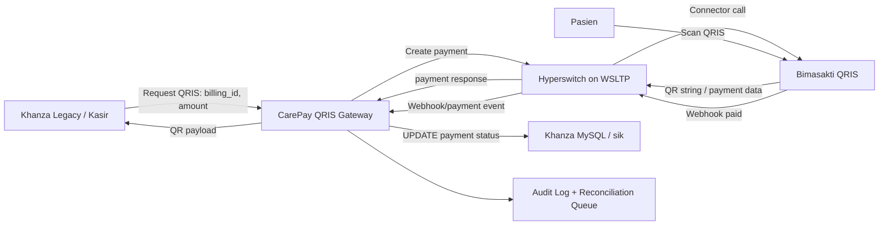
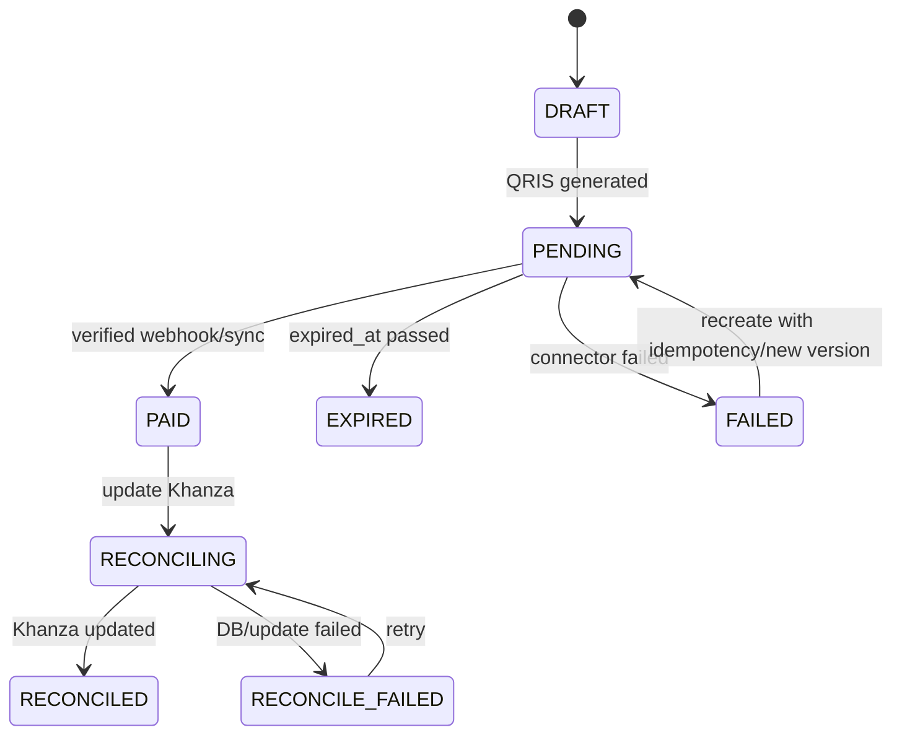

# ATR-008: Aplikasi Satelit Payment System QRIS Berbasis Hyperswitch

References:
https://api-docs.speedcash.co.id/docs/category/qris-mpm
https://github.com/speedcash-developer

## Status
**Proposed** (Fase Setelah `khanza-satusehat-sync` - Area Finansial, Kasir, dan Auto-Reconciliation)

## Konteks & Latar Belakang (Context)
Khanza adalah aplikasi legacy yang kuat secara fitur klinis dan operasional, tetapi pola integrasinya masih melekat pada arsitektur desktop/2-tier. Modernisasi tidak dilakukan dengan *big-bang rewrite*, melainkan dengan membangun aplikasi satelit di sekitar Khanza.

Tahap pertama sudah dimulai melalui `khanza-satusehat-sync`, yaitu satelit compliance untuk mengirim data EMR ke SATUSEHAT secara headless, resilien, dan dapat diaudit.

Tahap berikutnya adalah membangun **Aplikasi Satelit Payment System** untuk menghilangkan friksi dan kebocoran pembayaran di loket kasir. Fokus awal adalah **QRIS** di atas **Hyperswitch**, dengan Bimasakti sebagai connector/payment aggregator.

Pain point utama pada sistem legacy:
1. **Input nominal manual di kasir** membuka risiko salah ketik nominal dan selisih rekonsiliasi.
2. **Pembayaran QRIS/VA belum menjadi flow native Khanza**, sehingga status lunas sering membutuhkan pengecekan manual.
3. **Webhook tidak cocok ditembak langsung ke aplikasi desktop**, sehingga dibutuhkan service satelit yang selalu hidup sebagai receiver.
4. **Integrasi payment perlu mengikuti standar fintech modern**, termasuk signing, callback verification, idempotency, audit log, dan reconciliation.

## Constraint Infrastruktur
1. **Repository Hyperswitch utama berada di mesin WSLTP**
   - Path target: `~/OPREK2/hyperswitch/`
   - Akses dari mesin ini: `ssh wsltp`
2. **Mesin development payment memakai WSLTP**
   - Build, test, Docker compose, dan runtime Hyperswitch tidak dijalankan di mesin Khanza utama.
3. **Semua resource Docker payment memakai WSLTP**
   - PostgreSQL/Redis/Hyperswitch services/payment mock/connector mock berjalan di Docker environment WSLTP.
4. **Credential Bimasakti tersedia di WSLTP**
   - Path: `~/OPREK2/hyperswitch/bimasakti_credentials`
   - Credential tidak boleh disalin ke repository, tidak dicetak di log, dan hanya dibaca sebagai secret runtime.

## Keputusan Arsitektural (Decision)
Kita akan membuat aplikasi satelit payment bernama sementara **CarePay QRIS Gateway** yang berjalan berdampingan dengan ekosistem Hyperswitch di WSLTP, lalu berintegrasi secara aman dengan database Khanza.

### 1. Hyperswitch sebagai Payment Orchestrator
Hyperswitch dipakai sebagai payment routing/orchestration layer, bukan Khanza.

Tanggung jawab Hyperswitch:
- Membuat payment intent/session.
- Menghubungkan connector Bimasakti.
- Menjalankan signing/auth connector sesuai kebutuhan.
- Menyediakan payment status lifecycle.
- Menerima atau meneruskan webhook connector.

Tanggung jawab satelit CarePay:
- Menerima request pembayaran dari Khanza/middleware.
- Mengunci nominal dari tagihan Khanza.
- Membuat QRIS payment melalui Hyperswitch.
- Menyimpan mapping `billing_id` Khanza ke `payment_id` Hyperswitch.
- Menerima webhook status pembayaran.
- Melakukan auto-reconciliation ke database Khanza.
- Menyediakan dashboard operasional untuk kasir/finance.

### 2. QRIS First, VA dan EDC Menyusul
MVP berfokus pada QRIS karena:
- QRIS cocok untuk pasien rawat jalan dan pembayaran mandiri.
- Flow QRIS dapat diuji end-to-end melalui mock/sandbox.
- Risiko perangkat fisik lebih rendah daripada EDC.
- Business value langsung terlihat: pasien scan, status lunas otomatis.

Setelah QRIS stabil, modul berikutnya:
- Virtual Account.
- EDC/ECR LAN.
- Refund/void.
- Settlement report.

### 3. Payment Outbox dan Idempotency
CarePay wajib memakai pola outbox/idempotency.

Setiap request pembayaran dari Khanza menghasilkan record internal:
- `payment_request_id`
- `khanza_billing_id`
- `no_rawat`
- `patient_id/no_rkm_medis`
- `amount`
- `channel = QRIS`
- `status`
- `hyperswitch_payment_id`
- `idempotency_key`
- `expires_at`
- `created_at`
- `updated_at`

Idempotency key disusun dari:
`facility_id + khanza_billing_id + amount + channel + billing_version`

Tujuannya:
- Kasir bisa klik ulang tanpa membuat QRIS ganda.
- Network retry aman.
- Webhook yang datang berulang tidak membuat pembayaran diproses ganda.

### 4. Webhook Receiver sebagai Source of Truth Pembayaran
Khanza tidak menunggu sinkron HTTP dari bank. Status pembayaran dianggap sah saat webhook/payment sync menyatakan sukses dan signature sudah diverifikasi.

Webhook flow:
1. Bimasakti/Hyperswitch mengirim event payment status.
2. CarePay memverifikasi signature/event authenticity.
3. CarePay mencatat event mentah ke audit table.
4. CarePay mengubah status payment internal.
5. CarePay menjalankan reconciliation ke tabel Khanza.
6. Dashboard kasir menampilkan status `PAID`.

Jika update ke Khanza gagal, status payment tidak hilang. Event masuk ke retry queue/DLQ.

## Arsitektur Target



## Komponen Sistem

### 1. CarePay API Service
Service satelit yang mengekspos API internal untuk Khanza atau adapter middleware.

Endpoint awal:
- `POST /api/payments/qris`
- `GET /api/payments/:id`
- `POST /api/webhooks/hyperswitch`
- `POST /api/reconciliation/retry/:id`
- `GET /api/health`
- `GET /api/metrics`

Contoh request QRIS:

```json
{
  "facility_id": "rs-demo",
  "billing_id": "BILL-20260616-0001",
  "no_rawat": "2026/06/16/000001",
  "no_rkm_medis": "000123",
  "patient_name": "Pasien Demo",
  "amount": 50000,
  "currency": "IDR",
  "channel": "QRIS",
  "description": "Pembayaran Rawat Jalan"
}
```

Response:

```json
{
  "payment_request_id": "payreq_...",
  "status": "PENDING",
  "amount": 50000,
  "currency": "IDR",
  "qris_payload": "000201010212...",
  "expires_at": "2026-06-16T10:30:00+07:00"
}
```

### 2. Hyperswitch Runtime di WSLTP
Hyperswitch dijalankan di `ssh wsltp` dengan Docker resources di mesin WSLTP.

Expected resource:
- Hyperswitch router/server.
- PostgreSQL.
- Redis.
- Control center jika dibutuhkan.
- Bimasakti connector configuration.
- Optional connector mock untuk local E2E.

Credential source:
- `~/OPREK2/hyperswitch/bimasakti_credentials`

Aturan:
- File credential tidak di-commit.
- CarePay/Hyperswitch membaca credential via env var, Docker secret, atau mounted secret file.
- Log harus melakukan masking untuk `client_secret`, `api_key`, private key, dan signature material.

### 3. Khanza Database Adapter
Adapter melakukan reconciliation ke database `sik`.

Prinsip:
- Write operation minimal dan eksplisit.
- Tidak mengubah flow klinis.
- Tidak mengunci tabel besar.
- Semua update harus punya audit record.

Minimal table tambahan yang disarankan:
- `carepay_payment_requests`
- `carepay_payment_events`
- `carepay_reconciliation_jobs`
- `carepay_audit_logs`

Integrasi ke tabel Khanza existing harus dilakukan setelah mapping final terhadap schema pembayaran/kasir yang dipakai RS target.

### 4. Dashboard Finance/Kasir
Dashboard bukan bagian wajib MVP pertama, tetapi penting untuk operasional.

Fitur:
- Daftar pembayaran pending.
- QRIS regenerate/reprint.
- Status paid/expired/failed.
- Retry reconciliation.
- Export settlement.
- Filter by kasir, tanggal, channel, poli, dan status.

## State Machine Pembayaran



## Deployment Design

### Development Topology
Semua service payment berjalan di WSLTP:

```text
Laptop utama
  |
  | ssh wsltp
  v
WSLTP
  ~/OPREK2/hyperswitch/
    - Hyperswitch source/runtime
    - bimasakti_credentials
    - docker compose resources
    - CarePay service workspace
```

### Runtime Secrets
Credential Bimasakti di-load dari:

```text
~/OPREK2/hyperswitch/bimasakti_credentials
```

Dokumen ini sengaja tidak mendefinisikan isi credential. Implementasi harus menyediakan parser/loader yang memetakan secret ke env var runtime, misalnya:

```text
BIMASAKTI_CLIENT_ID
BIMASAKTI_CLIENT_SECRET
BIMASAKTI_MERCHANT_ID
BIMASAKTI_PRIVATE_KEY_PATH
BIMASAKTI_BASE_URL
HYPERSWITCH_ADMIN_API_KEY
HYPERSWITCH_BASE_URL
```

### Network
CarePay harus dapat mengakses:
- Hyperswitch API di WSLTP.
- Database Khanza target.
- Webhook ingress dari Hyperswitch/Bimasakti.

Untuk dev:
- Webhook dapat diuji memakai mock server di WSLTP.
- Jika butuh expose publik sementara, gunakan tunnel yang eksplisit dan tidak menyimpan credential di URL.

## Testing Strategy

### 1. Smoke Test
`TesterBimasaktiE2E.java` dapat dipertahankan sebagai smoke test manual awal, tetapi sebaiknya dinaikkan menjadi test yang:
- Membaca config dari env.
- Memvalidasi HTTP status.
- Parsing JSON dengan library.
- Assert field payment secara spesifik.
- Menghasilkan exit code non-zero saat gagal.

### 2. Contract Test Connector
Test untuk memastikan payload Hyperswitch ke Bimasakti sesuai kontrak:
- QRIS generate request.
- Signature headers.
- Timestamp format.
- Idempotency key.
- Error response mapping.

### 3. Webhook E2E Test
Skenario wajib:
1. Create QRIS dari billing Khanza mock.
2. Terima QR payload.
3. Simulasikan webhook `PAID`.
4. Assert status internal menjadi `PAID`.
5. Assert reconciliation job meng-update status billing mock.

### 4. Failure Test
Skenario gagal:
- Hyperswitch down.
- Bimasakti timeout.
- Duplicate webhook.
- Signature webhook invalid.
- Khanza DB unavailable.
- Reconciliation SQL gagal.

## Observability
CarePay wajib punya:
- Structured JSON logs.
- Correlation ID per billing/payment.
- Metrics:
  - `payment_qris_created_total`
  - `payment_paid_total`
  - `payment_expired_total`
  - `webhook_received_total`
  - `webhook_invalid_signature_total`
  - `reconciliation_success_total`
  - `reconciliation_failed_total`
  - `payment_latency_seconds`
- Health endpoint:
  - CarePay alive.
  - Hyperswitch reachable.
  - Khanza DB reachable.
  - Credential loaded without exposing values.

## Security & Compliance
1. Credential Bimasakti tidak boleh masuk git.
2. Semua secret harus dimasking di log.
3. Webhook wajib diverifikasi.
4. API internal CarePay wajib memakai auth minimal API key/JWT/mTLS sesuai deployment RS.
5. Callback/update pembayaran harus idempotent.
6. Audit log pembayaran tidak boleh bisa dihapus dari dashboard biasa.
7. Akses dashboard finance harus berbasis role.

## Konsekuensi (Consequences)

### Positif
- **Zero nominal typo:** nominal QRIS berasal dari billing Khanza, bukan input manual.
- **Auto-reconciliation:** status lunas bisa masuk otomatis tanpa klik cek manual.
- **Modernisasi tanpa rewrite:** Khanza tetap menjadi system of record operasional, payment logic dipindah ke satelit.
- **Reusable fintech layer:** setelah QRIS stabil, VA/EDC/refund/settlement dapat ditambahkan tanpa menyentuh banyak kode legacy.
- **Business moat:** integrasi payment + reconciliation adalah pain point finansial langsung, lebih mudah dijual dibanding modernisasi teknis murni.

### Negatif / Trade-off
- Menambah service baru yang harus dimonitor 24/7.
- Membutuhkan disiplin secret management.
- Perlu mapping hati-hati ke schema pembayaran Khanza yang bisa berbeda antar RS.
- Webhook/reconciliation membuat sistem finansial lebih otomatis, sehingga audit dan rollback policy harus matang.

## Roadmap Implementasi

### Fase 0 - Discovery & Infra
- Akses WSLTP: `ssh wsltp`.
- Validasi repo `~/OPREK2/hyperswitch/`.
- Inventarisasi Docker compose Hyperswitch.
- Validasi keberadaan credential di `~/OPREK2/hyperswitch/bimasakti_credentials` tanpa mencetak isinya.
- Tentukan schema billing Khanza target untuk update status pembayaran.

### Fase 1 - QRIS MVP
- Jalankan Hyperswitch dan dependency Docker di WSLTP.
- Konfigurasi connector Bimasakti.
- Bangun CarePay endpoint `POST /api/payments/qris`.
- Simpan mapping payment request.
- Return QRIS payload ke caller.
- Buat smoke test end-to-end.

### Fase 2 - Webhook & Auto-Reconciliation
- Implement webhook receiver.
- Verifikasi signature.
- Simpan raw event.
- Implement state machine payment.
- Implement reconciliation job ke database Khanza.
- Tambahkan retry dan DLQ.

### Fase 3 - Dashboard Finance
- Dashboard pending/paid/expired.
- Retry reconciliation.
- Export settlement harian.
- Audit trail per payment.

### Fase 4 - Scale Channel
- Virtual Account.
- EDC/ECR.
- Refund/void.
- Settlement reconciliation.
- Multi-RS/facility configuration.

## Open Questions
1. Tabel Khanza mana yang menjadi sumber tagihan final per instalasi RS?
2. Apakah payment dibuat dari kasir desktop, portal pasien, atau keduanya?
3. Apakah QRIS memakai model dynamic QR per billing atau static merchant QR dengan amount binding?
4. Apakah Bimasakti webhook akan masuk ke Hyperswitch dulu atau langsung ke CarePay?
5. Bagaimana kebijakan pembatalan jika billing berubah setelah QRIS dibuat?
6. Siapa source of truth status lunas: Khanza, Hyperswitch, atau CarePay?

## Rekomendasi
Mulai dari **QRIS dynamic payment + webhook paid + reconciliation ke billing mock** di WSLTP. Jangan langsung menyentuh tabel produksi Khanza sebelum state machine, audit log, idempotency, dan retry reconciliation stabil.

Setelah QRIS MVP terbukti, CarePay dapat menjadi fondasi produk fintech RS: pembayaran online, auto-reconciliation, settlement dashboard, dan MDR revenue sharing.
