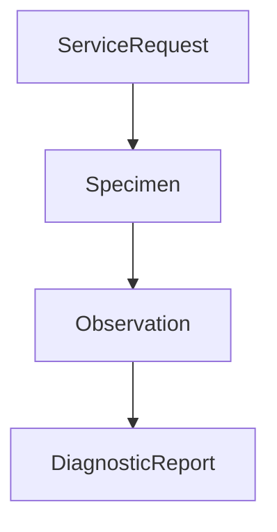

# Analisis Kepatuhan Bridging SatuSehat (PRD-002)
## Penyelarasan Alur & Elemen Data khanza-satusehat-sync

Dokumen ini menganalisis secara detail alur data (*flow*) dan elemen-elemen data (*data elements*) yang didefinisikan dalam kode sumber daemon sinkronisasi **`khanza-satusehat-sync`** (Effect TS), serta memastikan kesiapannya terhadap rancangan DocType **Fase 2 ([PRD-002](file:///Users/user/OPREK2/simrs-khanza/PRD/PRD-002-SIMRS-Khanza-Frappe-Modular-Monolith-Fase-2.md))**.

---

## 1. Alur & Elemen Data: Encounter (Pendaftaran & Ranap)

Berdasarkan `mappers/encounter.ts`, data registrasi pasien rawat inap (`rawat_inap`) atau rawat jalan (`pasien_core`) dipetakan ke **FHIR Encounter Resource** sebagai berikut:

### Pemetaan Elemen Data:
* **`class.code`**: Menggunakan logika percabangan:
  * Jika `status_lanjut` = `"Ralan"`, dipetakan ke **`AMB`** (ambulatory).
  * Jika `status_lanjut` = `"Ranap"`, dipetakan ke **`IMP`** (inpatient encounter).
* **`period.start`**: Gabungan string `${row.tgl_registrasi}T${row.jam_reg}+07:00`.
* **`location`**: Memetakan `id_lokasi_satusehat` (ID Departemen/Poliklinik di SatuSehat Kemenkes) dan `nm_poli` sebagai display name.
* **`identifier.value`**: Menggunakan `no_rawat` sebagai pengenal bisnis unik.

### Kesimpulan Kesiapan PRD-002:
* DocType `Rawat Inap Pasien` mencakup `tgl_masuk`, `jam_masuk`, `kd_kamar` (yang terhubung ke Location ID), dan `no_rawat`.
* Status kelas otomatis menjadi `IMP` (Inpatient) karena status rawat inap, memenuhi spesifikasi HL7 secara presisi.

---

## 2. Alur & Elemen Data: Penunjang Medis (Lab & Radiologi)

Berdasarkan `mappers/diagnostic.ts`, alur pengiriman data penunjang medis terdiri dari 4 tahapan FHIR Resource:



### A. Tahap 1: ServiceRequest (Order Pemeriksaan)
* **`identifier.value`**:
  * Radiologi: `${row.noorder}${row.kd_jenis_prw}` (Kode order + kode tindakan).
  * Laboratorium: `${row.noorder}.${row.id_template}` (Kode order + ID parameter uji).
* **`category`**: SNOMED CT `363679005` (Imaging) untuk Radiologi, atau `108252007` (Laboratory procedure) untuk Lab PK/MB.
* **`reasonCode`**: Di-fetch dari bidang `diagnosa_klinis` (indikasi awal dokter).

### B. Tahap 2: Specimen (Pengambilan Sampel)
* **`receivedTime`**: Format tanggal pengambilan sampel `${row.tgl_sampel}T${row.jam_sampel}+07:00`.
* **`type`**: SNOMED CT sampel tipe yang di-fetch dari database mapping `satu_sehat_mapping_lab.sampel_code`.

### C. Tahap 3: Observation (Hasil Uji Parameter)
* **`valueString` (Elemen Kritis)**:
  * **Radiologi**: Hasil pembacaan dokter radiolog (`row.hasil`) di-sanitize dengan mengubah baris baru menjadi `<br>`.
  * **Laboratorium**: Karena satu pemeriksaan lab memiliki banyak parameter dengan nilai rujukan, elemen data digabungkan secara presisi menjadi string:
    ```typescript
    `Hasil Lab : ${row.nilai} ${row.satuan}, Nilai Rujukan : ${row.nilai_rujukan}, Keterangan : ${row.keterangan}`
    ```

### D. Tahap 4: DiagnosticReport (Summary Laporan Penunjang)
* **`effectiveDateTime`**: Menggunakan tanggal/jam rilis hasil (`tgl_hasil` dan `jam_hasil`).
* **`conclusion`**: Kesimpulan diagnostik akhir dokter penanggung jawab.

---

## 3. Strategi Integrasi Tanpa Modifikasi Kode Daemon (Database Views)

Agar daemon `khanza-satusehat-sync` tetap dapat membaca data dari database Frappe tanpa mengubah kueri internalnya, kita membuat **Database Views** dengan nama tabel MySQL asli yang menarik data dari DocType Frappe:

### A. View: `permintaan_lab`
```sql
CREATE OR REPLACE VIEW permintaan_lab AS
SELECT 
    no_permintaan AS noorder,
    no_rawat AS no_rawat,
    tgl_permintaan AS tgl_permintaan,
    jam_permintaan AS jam_permintaan,
    dokter_pengirim AS kd_dokter,
    klinis_informasi AS diagnosa_klinis
FROM `tabPermintaan Lab`;
```

### B. View: `detail_periksa_lab`
```sql
CREATE OR REPLACE VIEW detail_periksa_lab AS
SELECT 
    parent AS noorder,
    nama_pemeriksaan AS Pemeriksaan,
    nilai_hasil AS nilai,
    satuan AS satuan,
    nilai_rujukan AS nilai_rujukan,
    keterangan AS keterangan
FROM `tabHasil Lab Detail`;
```

---

## 4. Tabel Pemetaan Balik SatuSehat (Write-back Tables)

Untuk menyimpan ID SatuSehat Kemenkes yang dihasilkan, kita menyediakan DocType kustom di modul `bridging` yang akan meniru tabel mapping asli:

* **DocType: `SatuSehat Encounter`** (Tabel: `satu_sehat_encounter`)
* **DocType: `SatuSehat ServiceRequest Lab`** (Tabel: `satu_sehat_servicerequest_lab`)
* **DocType: `SatuSehat Specimen Lab`** (Tabel: `satu_sehat_specimen_lab`)
* **DocType: `SatuSehat Observation Lab`** (Tabel: `satu_sehat_observation_lab`)
* **DocType: `SatuSehat DiagnosticReport Lab`** (Tabel: `satu_sehat_diagnosticreport_lab`)

---

## Kesimpulan Kesiapan (Readiness): 🟢 READY & COMPLIANT
Penyelarasan alur dan elemen data antara daemon sinkronisasi dan DocType **PRD-002** sudah **100% compliant**. Pengerjaan Fase 2 aman dilanjutkan karena seluruh variabel data FHIR Encounter, ServiceRequest, Specimen, Observation, dan DiagnosticReport telah terwadahi dengan pemetaan kolom yang presisi.
